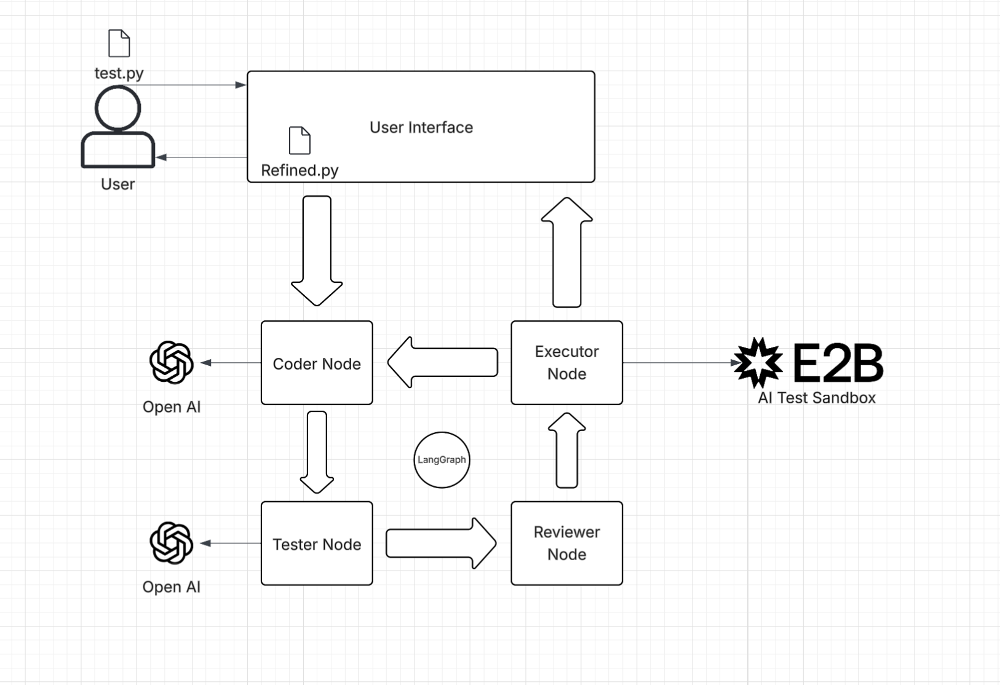

Research Software Engineer Agent - RSE Agent

This project is an agent that acts as an additonal RSE that can assist you in refining, reviewing, and testing code. You can start by dragging in a python file script, give the agent a task, and then watch it go! The agent will take into account RSE best practices and test your script. You will be returned a refined script file, along with test results showing how your old code vs the new code performed against relevant test cases.

The motivation of this project was based on INTERSECT training curriculum, which showcases lots of possible vulnerabilites RSEs and their respective programs may have. Many people who are creating such scripts may not be well versed in the realm of software engineers, as research software is not limited to just one field. Biology, Physics, Chemestry, even social sciences can take advantage of research software. Additionally, research software is not held to the same standard as typical commercial software, which prioritizes accessibility and security to it's users. 

We can see through their research that the research software may not be tested or reviewed as much as typical commercial software would be, thus the creation of this small project. The goal of this project was to create a digial feedback loop of refining, testing, and reviewing research software.

General Logic flow of Technology

There are four main nodes that are managed by LangGraph. What makes this project not just a simple LLM wrapper is because of this loop that is being created here

-Coder Node
    This node will be always be the first node in the loop. It receives the code from the user and will make improvements to the code based on the user's task as well as a prompt that has specialized RSE guidelines.

-Tester Node
    Based on the coder node's result, the tester node will make relevant test cases. Creating checks for logic errors and efficiency is what this function prioritizes.

-Reviewer Node
    INTERSECT training curriculum's research emphasizes the importance of guard rails in this type of development, and this node does a few static governance checks—hardcoded paths, version control hygiene, separation of concerns, and licensing-before heading to the final node in the basic sequence. This node also uses python's built in AST trees to test top level I/O.

-Executor Node
    The final node takes the updated code and the test code provided by Coder and Tester respectively, and runs them inside E2B sandbox environment. Here it can safely execute code, run pytests, and then return the results back to our loop. The node then does a final check to see if the results are desirable. Good results? The code makes it out of the loop and returns the data to the user. Not good? Then the loop will reiterate and the code will be sent back to coder with all of the previous context of earlier iterations.

